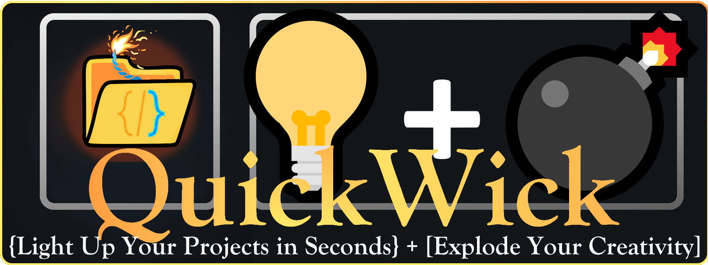

# QuickWick – Génesis de proyectos sin deuda técnica 🚀✨

**QuickWick** es una extensión para VS Code diseñada para ser tu **Arquitecto Senior + Generador de Proyectos**.  
A diferencia de los generadores tradicionales, QuickWick "ve" tu contexto real. Analiza tus ideas, tus archivos locales o incluso repositorios externos para generar una arquitectura coherente, documentada y lista para despegar.

---

## 🎯 Capacidades Principales

- **Launchpad Inteligente**: Inicia tu proyecto desde una idea breve, un enlace de GitHub o un escaneo de tu carpeta local.
- **Arquitectura Basada en Datos (DNA Scan)**: Escanea tu workspace actual para detectar stacks tecnológicos y pre-configurar automáticamente el asistente.
- **Generación Multi-Motor**: Soporte para Gemini, OpenAI y Ollama (Local).
- **Gobernanza Automatizada**: Genera simultáneamente el código, el contrato técnico (`contract.md`), la documentación de arquitectura y los estándares de calidad.
- **BYOK (Bring Your Own Key)**: Tú tienes el control de tus modelos y tus claves.

---

## 🧠 Configuración de Modelos (IA)

QuickWick es flexible. Puedes usar la potencia de la nube o la privacidad de tu local.

### 🏠 Ollama (Local & Privado)

Ideal si quieres que tu código nunca salga de tu máquina.

1. **Descarga**: Instala Ollama desde [ollama.com](https://ollama.com/).
2. **Descarga un modelo**: Abre tu terminal y ejecuta:

   ```bash
   ollama run llama3
   ```

3. **Uso**: Asegúrate de que Ollama esté corriendo. QuickWick detectará automáticamente tus modelos descargados.

### ♊ Gemini (Google Cloud)

Potencia y velocidad, a menudo con un generoso tier gratuito.

1. **API Key**: Consíguela en [Google AI Studio](https://aistudio.google.com/).
2. **Configuración**: Pulsa el botón "Set Gemini Key" en la extensión o introduce la clave en la pestaña IA del wizard.

### 🤖 OpenAI

El estándar de la industria.

1. **API Key**: Consíguela en el [OpenAI Platform](https://platform.openai.com/api-keys).
2. **Configuración**: Usa el comando `quickwick.setOpenAIApiKey` para guardar tu clave de forma segura en VS Code.

---

## 🛠 Estructura del Proyecto

```text
QuickWick/
├─ app/
│  ├─ QUICKWICK.tsx          # UI React de alta fidelidad (Génesis Wizard)
│  ├─ generator.ts           # Motor de generación basado en Handlebars
├─ src/
│  ├─ extension.ts           # Host de la extensión (gestión de archivos y comunicación)
│  └─ llmClient.ts           # Cliente unificado para Gemini/OpenAI/Ollama
├─ templates/                # Catálogo de plantillas (React, Node, FastAPI, Docker...)
└─ media/                    # Assets para la Webview
```

---

## ⚙️ Requisitos y Uso

1. **Instalación**: Descarga el archivo `.vsix` desde los releases y arrástralo a VS Code.
2. **Comando**: Abre la paleta de comandos (`Ctrl+Shift+P`) y busca `QuickWick: Abrir Wizard Génesis`.
3. **Escaneo**: Prueba el botón **"Escanear Workspace"**; verás cómo el asistente detecta automáticamente tu proyecto y rellena los campos por ti.

---

## 🤝 Roadmap 🧭

- [x] Persistencia de estado entre pestañas.
- [x] Integración de contexto de escaneo local.
- [x] Soporte para Ollama por delegación de host (sin bloqueos CORS).
- [ ] Soporte para ejecución de comandos post-generación (`npm install`, `docker-compose up`).
- [ ] Catálogo extendido de microservicios y plantillas Cloud Native.

---

<br />

<p align="center">
  <a href="https://pedromencias.netlify.app/">
     
  </a>
  <a href="https://www.linkedin.com/in/pedro-menc%C3%ADas-68223336b/">
     
  </a>
  <a href="https://www.buymeacoffee.com/beyonddigiv">
     
  </a>
</p>

<br/>

---

## 📝 Contribuir

Este es un proyecto vivo. Si tienes ideas para nuevas plantillas o arquitecturas, ¡siéntete libre de abrir un PR en nuestro [Repositorio de GitHub](https://github.com/Charran78/QuickWick)!

---
*Hecho con ❤️ por desarrolladores para desarrolladores.*
